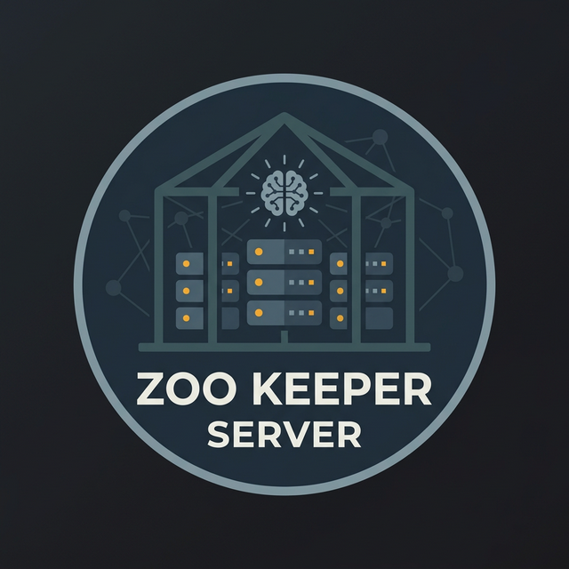

<p align="center">
  
</p>

<h1 align="center">zoo-keeper-server</h1>

<p align="center">
  <b>A local LLM inference server with an OpenAI-compatible REST API.</b><br/>
  <sub>llama.cpp-backed &bull; SSE streaming &bull; Sessions &bull; Tool invocations &bull; API key auth</sub>
</p>

<p align="center">
  
  
  
</p>

## About

`zoo-keeper-server` wraps the [zoo-keeper](https://github.com/crybo-rybo/zoo-keeper) agent library in a clean HTTP server. Drop in a GGUF model, point the config at it, and get an OpenAI-compatible `/v1/chat/completions` endpoint — with streaming, optional sessions, tool invocation tracking, and an observability metrics endpoint. Built with C++23 and [Drogon](https://github.com/drogonframework/drogon).

## Build

Clone with submodules:

```bash
git submodule update --init --recursive
```

Drogon is fetched at CMake configure time.

Configure and build:

```bash
cmake -S . -B build
cmake --build build --parallel
```

To compile the test-only browser console at `/_test`:

```bash
cmake -S . -B build-test-ui -DZKS_ENABLE_TEST_UI=ON
cmake --build build-test-ui --parallel
```

| Option | Default | Purpose |
|--------|---------|---------|
| `ZKS_ENABLE_TEST_UI` | OFF | Browser test UI at `/_test` |
| `ZKS_LIVE_SMOKE_MODEL` | (empty) | Path to GGUF model for live smoke test |
| `ZOO_ENABLE_METAL` | ON (macOS) | Apple Metal GPU acceleration |
| `ZOO_ENABLE_CUDA` | OFF | CUDA GPU acceleration |

## Test

```bash
cmake -S . -B build -DBUILD_TESTING=ON
cmake --build build --parallel
ctest --test-dir build --output-on-failure
```

## Run

```bash
./build/zoo_keeper_server config/server.example.json
```

Update `config/server.example.json` with a real GGUF `model_path` before startup will succeed.

## Configuration

```json
{
  "bind_address": "127.0.0.1",
  "port": 8080,
  "model_id": "local-model",
  "api_key": null,
  "sessions": {
    "max_sessions": 0,
    "idle_ttl_seconds": 900
  },
  "zoo": {
    "model_path": "/path/to/model.gguf",
    "context_size": 2048,
    "n_gpu_layers": -1,
    "max_tokens": -1,
    "system_prompt": "You are a helpful assistant."
  }
}
```

Set `api_key` to a non-null string to require `Authorization: Bearer <key>` on all non-`/healthz` endpoints. Omit or set to `null` for trusted localhost mode.

Set `sessions.max_sessions` to `0` (the default) to disable sessions entirely.

The `zoo` object is passed directly to `zoo::Config`. See [zoo-keeper](https://github.com/crybo-rybo/zoo-keeper) for the full set of options including sampling parameters.

## API

| Endpoint | Method | Notes |
|----------|--------|-------|
| `/healthz` | GET | `200` when ready, `503` otherwise |
| `/v1/models` | GET | Returns the configured `model_id` |
| `/v1/tools` | GET | Server-owned tool catalog |
| `/v1/sessions` | POST | Create a session |
| `/v1/sessions/{id}` | GET / DELETE | Session metadata / teardown |
| `/v1/chat/completions` | POST | OpenAI-compatible; supports `stream: true` |
| `/metrics` | GET | Request counters and uptime |

### Chat completions

`POST /v1/chat/completions` accepts:

- `model` — string
- `messages` — array of `{role, content}` objects; roles: `system`, `user`, `assistant`, `tool`
- `stream` — optional boolean for SSE
- `session_id` — optional; associates the request with a server-owned session

When `session_id` is omitted the request is stateless and `messages` should contain the full transcript. When present, `messages` must contain exactly one new `user` message — prior context comes from the session.

Responses include a `tool_invocations` array (empty or populated) and a `zoo_metrics` object with latency and throughput data.

### Metrics

`GET /metrics` returns:

```json
{
  "requests_total": 142,
  "requests_errors": 3,
  "active_sessions": 2,
  "model_id": "local-model",
  "uptime_seconds": 3600
}
```

## Examples

Create a session:

```bash
curl -s http://127.0.0.1:8080/v1/sessions \
  -H 'content-type: application/json' \
  -d '{"model": "local-model", "system_prompt": "You are a concise assistant."}'
```

Stateless completion:

```bash
curl -s http://127.0.0.1:8080/v1/chat/completions \
  -H 'content-type: application/json' \
  -d '{
    "model": "local-model",
    "messages": [{"role": "user", "content": "Say hello in one sentence."}]
  }'
```

Streaming:

```bash
curl -N http://127.0.0.1:8080/v1/chat/completions \
  -H 'content-type: application/json' \
  -d '{
    "model": "local-model",
    "stream": true,
    "messages": [{"role": "user", "content": "Say hello in one sentence."}]
  }'
```

With API key auth:

```bash
curl -s http://127.0.0.1:8080/v1/chat/completions \
  -H 'authorization: Bearer my-secret-key' \
  -H 'content-type: application/json' \
  -d '{
    "model": "local-model",
    "messages": [{"role": "user", "content": "Say hello in one sentence."}]
  }'
```

## Architecture

```text
HTTP Request → api_routes.cpp → ChatService → SessionManager (optional)
                                           → zoo::Agent → llama.cpp
                                                       → SSE or JSON response
```

One `zoo::Agent` is loaded at startup and shared across all requests. Sessions do not get their own agent instances — history is managed in `SessionManager` and injected per-request.

## Known Limitations

- **Sessions are in-memory and process-lifetime only.** There is no persistence; sessions are lost on restart.
- **macOS + Metal + sessions: OOM during inference will abort the process.**
  On macOS with Metal enabled, a device out-of-memory condition during inference triggers a fatal abort in the upstream `llama.cpp` Metal backend before `zoo-keeper` can surface a recoverable error. Reduce `n_gpu_layers` or `context_size`, or disable sessions (`max_sessions = 0`) if you hit this. Tracked upstream; see `docs/zoo-keeper-metal-oom-issue.md` for details.

## License

MIT
